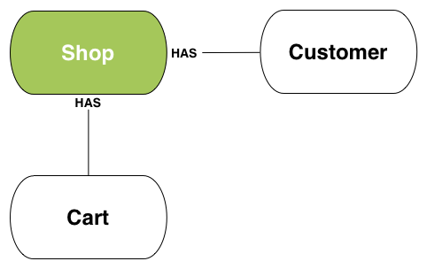

## Shop

The API's shop object is a collection of the general settings and information about the shop, meant to be utilized after different connection applications.

This is simply a GET method to allow output of shop information. Modifying shop data is restricted strictly to administrative tools.



#### What can you do with Shop?

The API lets you do the following with the Shop resource. More detailed versions of these general actions may be available:

| Propety | Structure |
|:---:|:---:|
| address1 | `{ "address1" : "1 Infinite Loop" }` The shop's street address. |
| city | `{ "city" : "Cupertino" }` The city in which the shop is located. |
| country | { "country" : "US" } The shop's country (by default equal to the two-letter country code). |
| country_code | `{ "country_code" : "US" }` The two-letter country code corresponding to the shop's country. |

country_name
{ "country_name" : "United States" }
The shop's normalized country name.

created_at
{ "created_at" : "2007-12-31T19:00:00-05:00" }
The date and time when the shop was created. The API returns this value in ISO 8601 format.

currency
{ "currency" : "USD" }
The three-letter code for the currency that the shop accepts.

domain
{ "domain" : "shop.apple.com" }
The shop's domain.

email
{ "email" : "steve@apple.com" }
The contact email address for the shop.

id
{ "id" : 690933842 }
A unique identifier for the shop.

latitude
{ "latitude" : "45.427408" }
Geographic coordinate specifying the north/south location of a shop.

longitude
{ "longitude" : "-75.68903" }
Geographic coordinate specifying the east/west location of a shop.

money_format
{ "money_format" : "$" }
A string representing the way currency is formatted when the currency isn't specified.

money_with_currency_format
{ "money_with_currency_format" : "$ USD" }
A string representing the way currency is formatted when the currency is specified.

name
{ "name" : "Apple Computers" }
The name of the shop.

password_enabled
{ "password_enabled" : false }
Indicates whether the Storefront password protection is enabled.

phone
{ "phone" : "null" }
The contact phone number for the shop.

province
{ "province" : "California" }
The shop's normalized province or state name.

province_code
{ "province_code" : "CA" }
The two-letter code for the shop's province or state.

public
{ "public" : "null" }
shop_owner

{ "shop_owner" : "Steve Jobs" }
The username of the shop owner.

source
{ "source" : "null" }

tax_shipping
{ "tax_shipping" : "null" }
Specifies wether or not taxes were charged for shipping. Valid values are: "true" or "false."

taxes_included
{ "taxes_included" : "null" }
The setting for whether applicable taxes are included in product prices. Valid values are: "true" or "null."

county_taxes
{ "county_taxes" : "null" }
The setting for whether the shop is applying taxes on a per-county basis or not (US-only). Valid values are: "true" or "null."

timezone
{ "timezone" : "(GMT-05:00) Eastern Time" }
The name of the timezone the shop is in.

zip
{ "zip" : "95014" }
The zip or postal code of the shop's address.

has_storefront
{ "has_storefront" : true }
Indicates whether the shop has web-based storefront or not.

_GET /admin/shop.json_

```
HTTP/1.1 200 OK

{
  "shop": {
    "address1": "1 Infinite Loop",
    "city": "Cupertino",
    "country": "US",
    "created_at": "2007-12-31T19:00:00-05:00",
    "domain": "shop.apple.com",
    "email": "steve@apple.com",
    "id": 690933842,
    "latitude": 45.45,
    "longitude": -75.43,
    "name": "Apple Computers",
    "phone": "1231231234",
    "primary_location_id": null,
    "province": "California",
    "public": null,
    "source": null,
    "zip": "95014",
    "country_code": "US",
    "country_name": "United States",
    "currency": "USD",
    "timezone": "(GMT-05:00) Eastern Time (US & Canada)",
    "shop_owner": "Steve Jobs",
    "money_format": "$ ",
    "money_with_currency_format": "$  USD",
    "province_code": "CA",
    "taxes_included": null,
    "tax_shipping": null,
    "county_taxes": true,
    "money_in_emails_format": "$",
    "money_with_currency_in_emails_format": "$ USD",
    "eligible_for_payments": true,
    "requires_extra_payments_agreement": false,
    "password_enabled": false,
    "has_storefront": true
  }
}
```